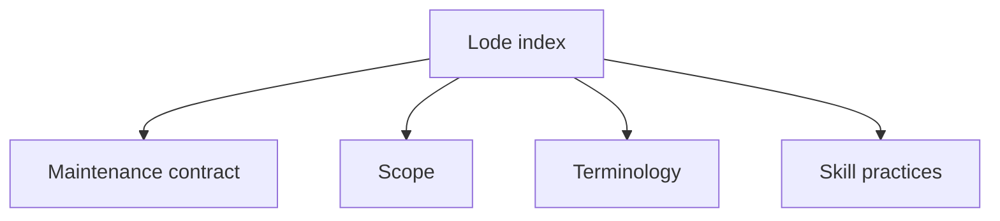

# Lode index

- [readme.md](readme.md): purpose, session entry, and maintenance contract.
- [summary.md](summary.md): repository scope.
- [terminology.md](terminology.md): shared terms.
- [practices.md](practices.md): skill packaging and verification.
- `plans/`: roadmaps and open work.
- `tmp/`: ignored session notes and handovers.

Keep this index aligned with persistent documents so agents can find the applicable guidance before searching source files.

```powershell
Get-Content lode/practices.md
```


