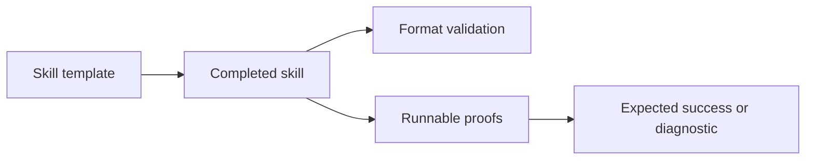

# Skill packaging

Use [skills/README.md](../skills/README.md) and the [Agent Skills specification](https://agentskills.io/specification) when creating skills.
The template is a starting point. Replace its placeholders before distributing a skill.
The frontmatter `name` must match the skill directory name.

The [repository README](../readme.md) is the user-facing skill catalog.
Update it with every skill addition, change, rename, or removal.
Keep each skill's purpose, reason for use, usage instructions, prerequisites, and links aligned with its files.
Document verification commands separately from verified results so instructions do not imply successful execution.

Bundle relevant proof scripts under each skill's `scripts/` directory. Use relative paths and document prerequisites.
Local machine paths do not provide portable evidence. Public files must exclude private content.
For compile-time break tests, check the expected diagnostic as well as compilation failure. An unrelated compiler failure is not proof.

Example format check, when `skills-ref` is installed:

```powershell
skills-ref validate ./skills/<skill-name>
```

This command checks the format. Run the bundled proof scripts separately to verify behavior.



See [terminology](terminology.md) for the meaning of proof scripts and compile-time break tests.
See [readme.md](readme.md) for the project knowledge maintenance contract.
