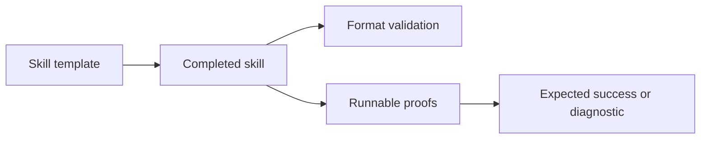

# Skill packaging

Use [skills/README.md](../skills/README.md) and the [Agent Skills specification](https://agentskills.io/specification) when creating skills.
The template is a starting point. Replace its placeholders before distributing a skill.
The frontmatter `name` must match the skill directory name.

The `skills/<skill-name>/SKILL.md` layout supports discovery by the [skills CLI](https://github.com/vercel-labs/skills).
No npm package manifest is required. GitHub installation uses the published files, not uncommitted local skills.

Keep general .NET reliability skills in [dotnet-reliability-skills](https://github.com/TheAngryByrd/dotnet-reliability-skills).
Link that collection from the repository README instead of duplicating its generator-review and mutation-testing guidance.
The parsing and type-check graph skills are self-contained guidance. They do not include proof runners.

The IWSAM and environment proof runners use a `scripts/global.json` with SDK `10.0.100` and `latestFeature` roll-forward.
The runners select their script directory before invoking `dotnet`, so a parent SDK pin does not select F# 8.
F# 8 can report `FS0192` on the IWSAM examples. Preserve the SDK file when packaging these skills.
The examples use `FsToolkit.ErrorHandling` 5.2.0 for `result`, `validation`, and `taskResult`.
Do not add the obsolete `FsToolkit.ErrorHandling.TaskResult` package.

The Native AOT proof runner is project-based because `dotnet fsi` cannot publish a native exe.
Its `scripts/` directory holds `Directory.Build.props`, `Directory.Build.targets`, and `Directory.Packages.props`.
These files stop parent MSBuild files, such as central package management, from changing the proof.
`Directory.Build.props` sends `bin` and `obj` to the system temp directory, so an installed skill contains no build output.
The runner compares each probe's JIT and native results with an expected verdict: `same`, `throws`, or `differs`.
Each metadata fix needs its own small exe. A fix in a shared exe keeps metadata for every probe in that exe.

Skill evals live in `evals/<skill>/`, outside the skill directory, so installed skills do not carry them.
[evals/README.md](../evals/README.md) documents the runner, the task format, and the grader contract.
An eval task must depend on a skill fact that the agent cannot guess or check during a normal build. A cautious agent passed the first `fsharp-native-aot` tasks without the skill, so those tasks measured nothing.
Graders run the agent's output, for example as a JIT build and as a native exe.
Before you use a grader, test it against a known good result and a known bad result.
Eval workspaces live in the temp directory. A parent `global.json` above this repository pins SDK 8, and a parent `Directory.Packages.props` turns on central package management.
Graders run `dotnet` from the project directory because `dotnet` selects its SDK from the working directory.
A run with the skill counts only when the transcript shows that the agent loaded the skill.

Check local discovery from the repository root:

```sh
npx skills add . --list
```

Before publishing packaging changes, install the selected skills from an absolute local path into a temporary project.
Compare the installed entry points and supporting files with their source files.

The [repository README](../readme.md) is the user-facing skill catalog.
Update it with every skill addition, change, rename, or removal.
Keep each skill's purpose, reason for use, usage instructions, prerequisites, and links aligned with its files.
Document verification commands separately from verified results so instructions do not imply successful execution.

Bundle relevant proof scripts under each skill's `scripts/` directory. Use relative paths and document prerequisites.
Local machine paths do not provide portable evidence. Public files must exclude private content.
For compile-time break tests, check the expected diagnostic as well as compilation failure. An unrelated compiler failure is not proof.
Proof runners reject unexpected compiler errors and preserve the complete inferred signatures for inspection.
The runners require PowerShell 7.2 or later so redirected native stderr does not terminate expected compiler-failure checks.
Successful example execution does not assert the printed runtime outcomes. Compare those outcomes with each skill's findings document.

Example format check, when `skills-ref` is installed:

```powershell
skills-ref validate ./skills/<skill-name>
```

This command checks the format. Run the bundled proof scripts separately to verify behavior.



See [terminology](terminology.md) for the meaning of proof scripts and compile-time break tests.
See [readme.md](readme.md) for the project knowledge maintenance contract.
