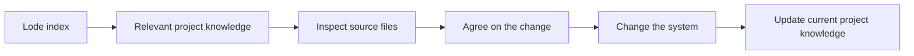

# Project knowledge

The Lode stores persistent project knowledge for agents working on `fsharp-skills`.
It describes the current system, its contracts, and the reasons for project decisions.
[AGENTS.md](../AGENTS.md) defines the maintenance rules. The human owns the code and makes final decisions.

## Start a session

Read the [index](lode-map.md), [terminology](terminology.md), and [summary](summary.md) before exploring the repository.
Use [practices](practices.md) when creating or changing skills.

```powershell
Get-Content lode/lode-map.md
Get-Content lode/terminology.md
Get-Content lode/summary.md
```



## Maintain the Lode

Keep each file focused on one topic and below 250 lines. Link related files with relative paths.
Include concrete examples and Mermaid diagrams. Record contracts, invariants, reasons, and durable lessons where they apply.
Update the index when adding or moving a document.

Source files take precedence when documentation differs. Explain the difference and request confirmation of the proposed Lode correction.
Only delete a Lode file if it exists in the repository and has no uncommitted changes.

Store roadmaps and open work in `plans/`. Store session notes and handovers in the Git-ignored `tmp/` directory.
Keep completed-work reports out of persistent documents. This separation prevents session history from being mistaken for current behavior.
