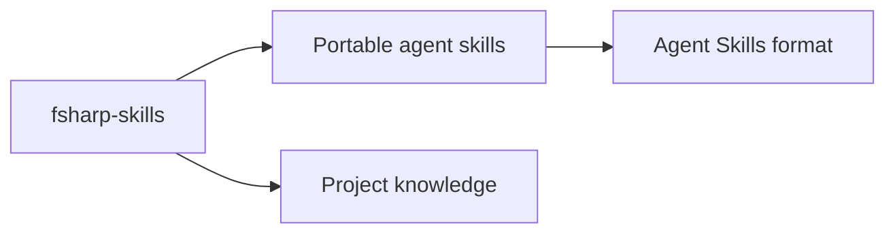

# Repository scope

`fsharp-skills` is a public repository for F# agent skills. Skills use the Agent Skills format and live under `skills/`. The repository provides creation instructions and a reusable template. Each completed skill has a `SKILL.md` entry point and can include supporting references, scripts, and assets. The Lode records project knowledge separately from installable skills. See [practices](practices.md) for the packaging contract and [terminology](terminology.md) for shared terms.

The [repository README](../readme.md) lists skills and explains their purpose and use.

Example entry-point metadata:

```yaml
name: fsharp-example
description: Explain an F# example when the user requests an explanation.
```


