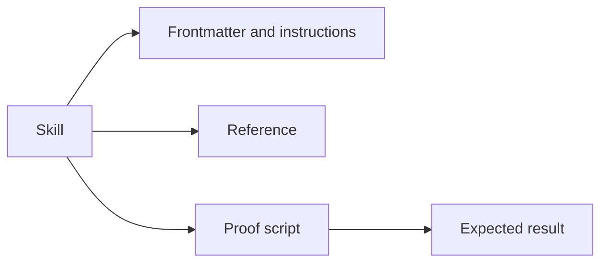

# Terminology

- Skill - A directory with a `SKILL.md` entry point and optional supporting resources.
- Frontmatter - YAML metadata at the start of `SKILL.md`, including `name` and `description`.
- Reference - Supporting documentation loaded when the skill needs it.
- Proof script - A runnable example that demonstrates a skill claim.
- Compile-time break test - A check that an intentionally invalid program fails compilation for the expected reason.
- Lode - Persistent project knowledge under `lode/`.

Use these terms consistently in [practices](practices.md) and skill documentation. A failure alone does not prove the expected compiler constraint.

Example proof-script invocation:

```powershell
dotnet fsi ./skills/<skill-name>/scripts/<proof-name>.fsx
```


