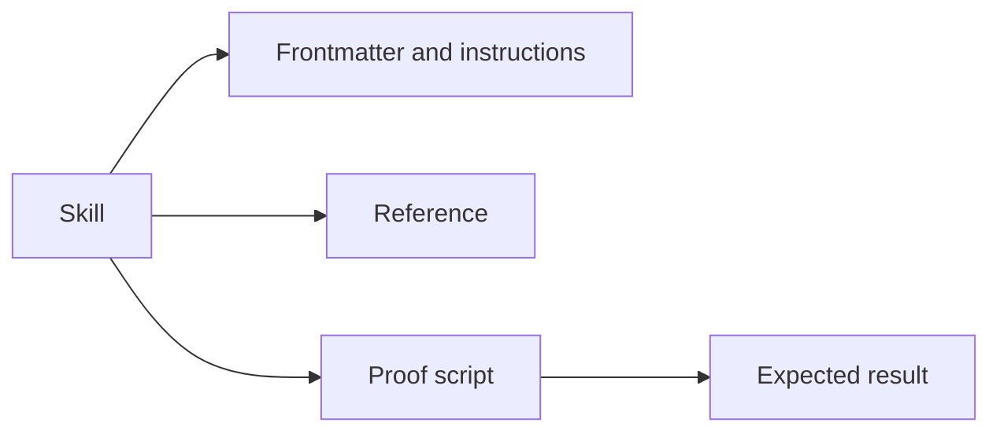

# Terminology

- Skill - A directory with a `SKILL.md` entry point and optional supporting resources.
- Frontmatter - YAML metadata at the start of `SKILL.md`, including `name` and `description`.
- Reference - Supporting documentation loaded when the skill needs it.
- Proof script - A runnable example that demonstrates a skill claim.
- Compile-time break test - A check that an intentionally invalid program fails compilation for the expected reason.
- Lode - Persistent project knowledge under `lode/`.
- Native AOT - .NET ahead-of-time compilation to a native exe, enabled by `PublishAot`.
- Probe - A named case in a proof app whose output the runner compares between builds.
- JIT-versus-native diff - A comparison of the same probe output from `dotnet run` and from the native exe.
- Eval - A task that an agent runs with and without a skill, graded by a script.
- Grader - A script that checks an agent's output and writes `grading.json`.
- Baseline - An eval run without the skill.
- Contamination - A global skill on the same subject that a baseline run can load.
- Silent data loss - Native exe output that has less content than the JIT output, with no exception.

Use these terms consistently in [practices](practices.md) and skill documentation. A failure alone does not prove the expected compiler constraint.

Example proof-script invocation:

```powershell
dotnet fsi ./skills/<skill-name>/scripts/<proof-name>.fsx
```


