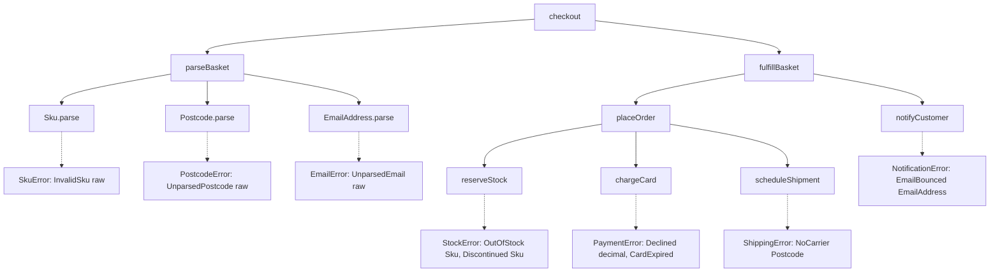
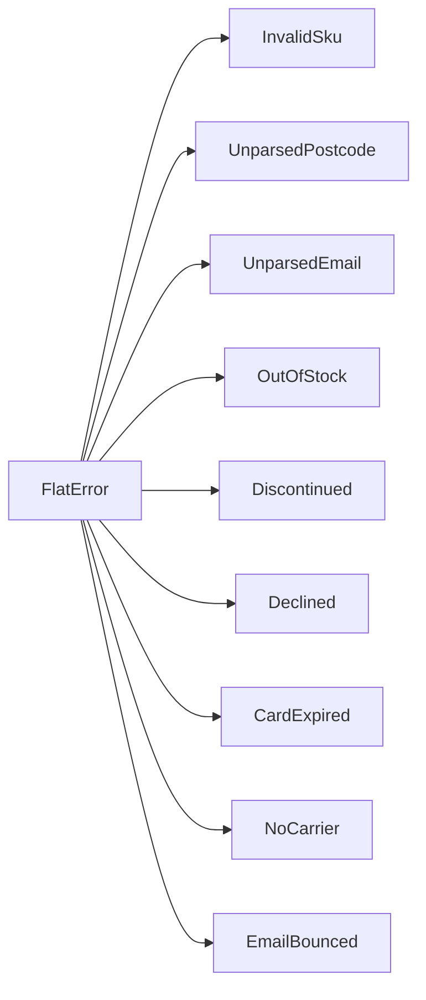
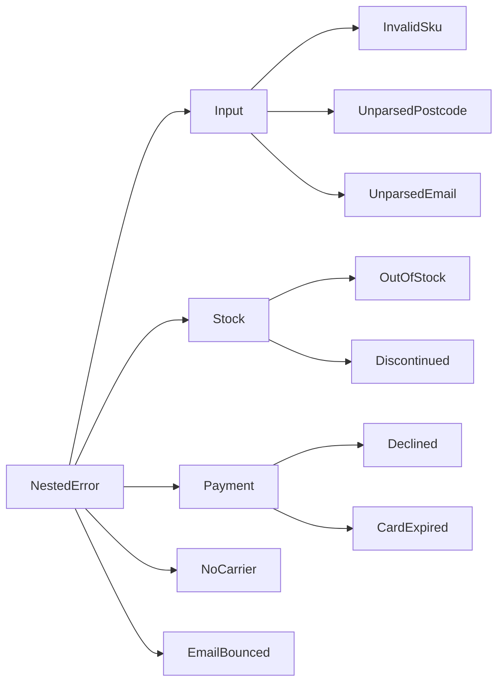
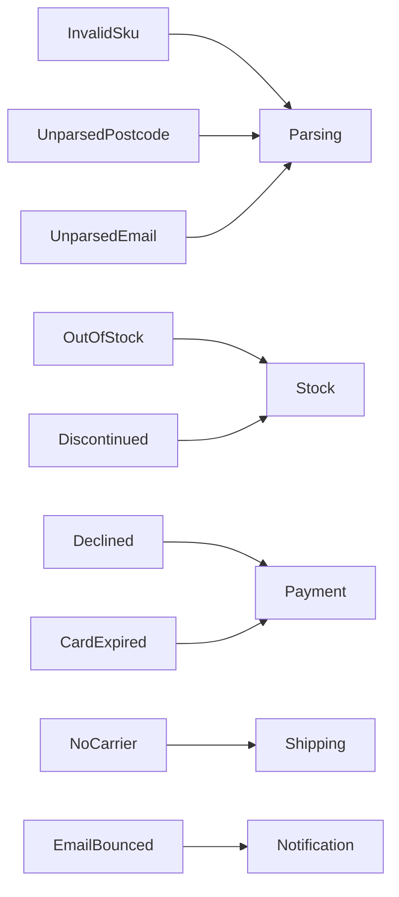
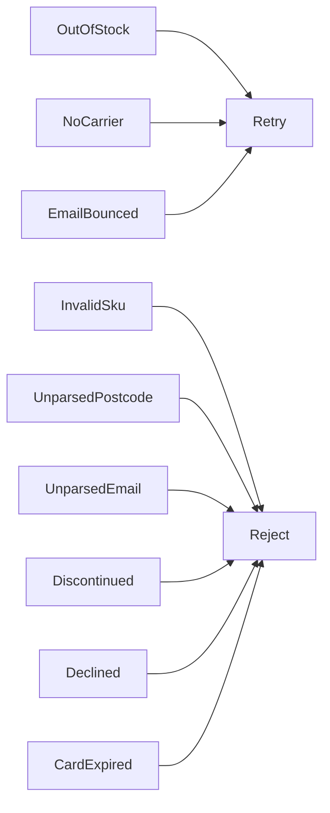

# Findings: IWSAM error trees

These scripts test the idea in [Using IWSAMs to deal with Dynamic Error Trees](https://gist.github.com/TheAngryByrd/ceb18e5b219458084f6c156b538ba579).
Each leaf function declares its errors as an interface with static abstract members (IWSAM).
The caller at the edge picks one concrete type that implements every interface the call tree needs.
The scripts show seven edge shapes for the same call tree and record the limits found.

All scripts run on the .NET 10 SDK with `dotnet fsi`. Run the runner from the skill root.

## Design rules

- An error payload is a typed value. A `string` appears in an error only when it comes from
  outside the domain: the raw input that failed to parse, for example `InvalidSku of raw: string`,
  or a message an external library or call returned.
- A domain value such as `Sku`, `Postcode`, or `EmailAddress` has a private constructor and a
  `parse` function. Code outside the module cannot build one without parsing.
- Each parse failure is its own IWSAM leaf, for example `SkuError<'e>` with `InvalidSku`.
- Parsing happens once at the input boundary. The domain functions receive parsed values and do
  not check them again.

## Files

| File | Purpose |
| --- | --- |
| `Domain.fsx` | Three parsed value types, seven error interfaces, four leaf functions, the parse boundary, and shared fixtures. No edge types. |
| `Shapes.fsx` | Seven edge types for the same call tree, plus two proofs about reuse and call-site identity. |
| `Effects.fsx` | The same leaves inside `taskResult` and `validation`. |
| `breaks/AddLeaf.fsx` | Must fail. Proves that a new leaf forces every edge type to handle it. |
| `breaks/BypassConstructor.fsx` | Must fail. Proves that a caller cannot build a `Sku` without `Sku.parse`. |
| `breaks/Unresolved.fsx` | Must fail. Shows the error when nothing fixes the edge type. |
| `breaks/WrongEdge.fsx` | Must fail. Shows the error when the edge type misses an interface the tree needs. |
| `run.ps1` | Runs every script, prints inferred signatures, and checks that each `breaks` script fails. |

Run everything:

```powershell
pwsh -NoProfile -File ./scripts/run.ps1
```

## The call tree

The domain is a checkout. `checkout` parses a `RawBasket` into a `Basket`, then fulfills it.
The composite functions do not name an error type.



## Finding 1: the constraint is the union of the leaves, not the bundle interface

`Domain.fsx` defines `InputError<'e>` and `CheckoutError<'e>` as interfaces that inherit the leaf
interfaces. The inferred constraints do not name them. They name the leaf interfaces directly:

```text
val checkout:
  onHand: Map<Sku,int> -> card: Card -> raw: RawBasket -> Result<unit,'a>
    when 'a :> NotificationError<'a> and 'a :> ShippingError<'a> and
         'a :> PaymentError<'a> and 'a :> StockError<'a> and
         'a :> EmailError<'a> and 'a :> PostcodeError<'a> and
         'a :> SkuError<'a>
```

The compiler uses a bundle interface only to check implementers. It lets an edge type implement
several interfaces in one block. The gist presents `CarError<'e>` as the unifying type. The caller
can omit it.

## Finding 2: parse functions are leaves too

`Sku.parse` is a generic function with one constraint:

```text
val parse: raw: string -> Result<Sku,'e> when 'e :> SkuError<'e>
```

The parse boundary composes with the domain functions in one `result` block. The edge type gains
three cases, one for each raw input that can fail. The raw `string` lives only in those cases.

## Finding 3: the edge type can take any shape

`Shapes.fsx` runs the same ten scenarios through `checkout` with six different edge types.
The seventh shape, Narrow, calls `chargeCard` alone.
The call tree does not change. Only the edge type changes.

### Flat

One case for each leaf. This is the gist's `StartCarError` shape.



```text
invalid sku        -> Error (InvalidSku "a-1")
out of stock       -> Error (OutOfStock Sku "B")
declined           -> Error (Declined 600M)
```

### Nested

One branch for each interface. This is the gist's `StartOfDayError` shape.
The inner types are plain DUs. Only the outer type implements the interfaces.



```text
invalid sku        -> Error (Input (InvalidSku "a-1"))
out of stock       -> Error (Stock (OutOfStock Sku "B"))
declined           -> Error (Payment (Declined 600M))
```

### Collapsed

Every leaf becomes the stage that failed. The payloads are dropped. The handler still gets a
typed value to branch on. The gist does not show this shape. It proves that the leaf count does
not fix the case count.



```text
invalid sku        -> Error Parsing
out of stock       -> Error Stock
declined           -> Error Payment
```

### Policy

The leaves are regrouped by what the caller does next. The grouping does not follow the interfaces.
`OutOfStock` and `NoCarrier` come from different interfaces and map to `Retry`. Each group keeps a
typed reason.



```text
out of stock       -> Error (Retry (Restock Sku "B"))
discontinued       -> Error (Reject (Discontinued Sku "Z"))
```

### Narrow

A caller that uses the leaf `chargeCard` alone needs an edge type with two cases.
This shows leaf reuse. It does not show subset reuse of a composite. A caller of `placeOrder`
must implement all three interfaces, as `breaks/WrongEdge.fsx` proves. A caller that does not
care about some leaves maps them to one case, as the Collapsed and Policy shapes show.

```text
Error CardExpired
```

### Record

A record with a typed HTTP status beside the flat cause. A record can implement an IWSAM.

```text
invalid sku        -> BadRequest InvalidSku "a-1"
out of stock       -> Conflict OutOfStock Sku "B"
declined           -> PaymentRequired Declined 600M
```

### Exception

A class that inherits `System.Exception` and carries the flat cause in a `Cause` property.
Use this shape for code that must throw, or for code that a C# caller consumes.

```text
out of stock       -> CheckoutException OutOfStock Sku "B"
declined           -> CheckoutException Declined 600M
```

## Finding 4: one call, two edge types

`SameTreeTwoEdges` in `Shapes.fsx` calls `checkout` twice with the same arguments.
Only the type annotation on the result differs.

```text
flat   -> Error (OutOfStock Sku "B")
policy -> Error (Retry (Restock Sku "B"))
```

## Finding 5: taskResult and validation work with unchanged leaves

`Effects.fsx` wraps the leaves in `Task` and composes them with `taskResult`.
It also composes the synchronous leaves with `validation` and `and!`.
The `validation` block needs `Result.mapError List.singleton` on each binding.
Inference resolves the edge type in both.

```text
== taskResult ==
Error (OutOfStock Sku "B")

== validation: all leaves collected into one edge list ==
Error [OutOfStock Sku "B"; CardExpired; NoCarrier Postcode "ZZ9 9ZZ"]
```

## Finding 6: a new leaf breaks every edge type at compile time

`breaks/AddLeaf.fsx` adds `Backordered` to `StockError<'e>` and leaves one edge type unchanged.
The compiler reports:

```text
error FS0366: No implementation was given for 'static abstract StockError.Backordered: sku: Sku -> 'e'. Note that all interface members must be implemented and listed under an appropriate 'interface' declaration, e.g. 'interface ... with member ...'.
```

This is the safety claim from the gist, confirmed. A new leaf cannot reach production unhandled.

## Finding 7: a caller cannot bypass the parser

`breaks/BypassConstructor.fsx` writes `Sku "a-1"` outside the `Sku` module.
The compiler reports:

```text
error FS1093: The union cases or fields of the type 'Sku' are not accessible from this code location
```

`Fixtures` in `Domain.fsx` builds its values through `Sku.parse`, `Postcode.parse`, and
`EmailAddress.parse` with a three-case edge type. A bad fixture fails at load time.

## Limit 1: something must fix the edge type

`breaks/Unresolved.fsx` matches on `checkout` with `Error _` and no annotation.
The compiler reports:

```text
error FS0331: The implicit instantiation of a generic construct at or near this point could not be resolved because it could resolve to multiple unrelated types, e.g. 'ShippingError <'_?74265>' and 'NotificationError <'_?74265>'. Consider using type annotations to resolve the ambiguity
```

The number in `'_?74265` changes between compiler runs.

The fix is one of:

- Annotate the result, for example `let r: Result<unit, FlatError> = ...`.
- Match on a concrete case, which fixes the type by inference. The gist's `run()` does this.

## Limit 2: the edge type misses an interface

`breaks/WrongEdge.fsx` passes a two-case `PaymentOnly` edge to `placeOrder`.
The compiler reports:

```text
error FS0001: The type 'PaymentOnly' is not compatible with the type 'ShippingError<PaymentOnly>'
```

The message names the first missing interface only. Add one implementation and compile again
to find the next.

## Limit 3: the edge sees the leaf, not the call site

A static member is one function per edge type. Two calls to the same leaf with the same input
produce the same value. `PerLeafNotPerPath` in `Shapes.fsx` calls `scheduleShipment` twice:

```text
untagged -> Error (NoCarrier Postcode "ZZ9 9ZZ") (which leg?)
tagged   -> Error (FirstLeg (NoCarrier Postcode "ZZ9 9ZZ"))
```

To record the call site, use `Result.mapError` at that call, as the regular approach does.
The IWSAM approach removes the mapping for leaf identity. It does not remove the mapping for
call-site identity.

## Limit 4: record field inference

`OrderLine` and `RawLine` both have a `Sku` field. F# infers the last declared record for a
bare `{ Sku = ...; Quantity = ... }` expression. `parseLine` annotates its return value as
`OrderLine` for that reason.

## Note: `#nowarn "3535"` inside the script

`dotnet fsi` still prints warning FS3535 for the main script when `#nowarn "3535"` sits inside
that script. Scripts loaded through `#load` do not print it. `run.ps1` passes `--nowarn:3535`
on the command line.
